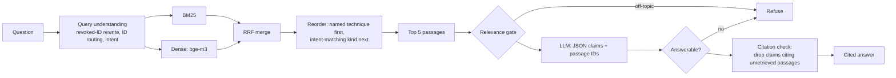

# threat-intel-rag

Grounded question answering over **MITRE ATT&CK**: ask how to detect, mitigate or recognise an
attack technique — in English or Chinese — and get an answer where every sentence cites the ATT&CK
passage it came from, or an explicit refusal when the data doesn't support an answer.

**Demo (recorded results, no setup):** https://rag.marklu.page/ — real
evaluation questions with each answer's citations, the judge's verdict on every sentence, and the
retrieval trace.

Most RAG demos stop at "it answers". This one is built to **measure** whether its answers can be
trusted: a 78-question evaluation set, separate scores for retrieval and generation, and a
prompt-injection / RAG-poisoning test harness.

```text
Q: 怎麼偵測攻擊者執行混淆過的 PowerShell 指令?
  - 偵測 PowerShell 被濫用時，可監控以編碼指令啟動、異常父進程或載入可疑模組的行為鏈。 [T1059.001:detection]

Q: How do I detect T1086?
  (T1086 was replaced by T1059.001 in this ATT&CK release)
  - PowerShell detection focuses on behavioral chains where PowerShell is executed with encoded
    commands, unusual parent processes, or suspicious modules loaded. [T1059.001:detection]

Q: Which techniques does APT29 use?
  [refused by llm] The provided passages do not contain information about the techniques used by APT29.
```

## Results

All numbers come from [`eval/RESULTS.md`](eval/RESULTS.md) and the raw runs in `eval/results/`.
Answers, faithfulness and attacks: Qwen `qwen3.8-27b` via OpenRouter, pinned to one host.

| What | Result |
|---|---|
| Retrieval, passage-level hit@5 (53 answerable questions) | **47.2% → 83.0%** after query understanding |
| — questions naming a near-duplicate technique ID | 46.7% → **100%** |
| — questions using a revoked ATT&CK ID | 0% → **100%** |
| Answers citing the correct passage, when retrieval found it | **44 of 44** |
| Out-of-scope questions refused | **23 of 25** |
| Answer sentences fully supported by the passages they cite (LLM judge) | **99.1%** (225 of 227) |
| — judge agreement with blind human labels (40 sentences) | Cohen's κ **0.87**, 95% agreement |
| Intent detection on phrasings never seen during tuning | 4/20 (keyword rules) → **16/20** |
| Successful prompt-injection / poisoning attacks (70 per configuration) | free-prose control **40** → structured output **4** → plus defenses **2** |

The most useful finding: in every category, "answer cites the correct passage" exactly equals
"retrieval found the correct passage". The LLM is faithful to its evidence; **retrieval is the
bottleneck**, so better retrieval — not a pricier model — is where further gains are.

## How it works



**Data.** ATT&CK Enterprise v19.2, pinned and verified by SHA-256. Each of the 697 techniques and
sub-techniques becomes three passages — Overview, Mitigation, Detection (2,091 total) — split along
ATT&CK's own structure rather than fixed-size chunks, each with a heading naming its technique.
Techniques with no mitigation get an explicit "ATT&CK lists no mitigations" passage, so the
absence is retrievable instead of letting another technique's mitigations be retrieved in its place.

**Retrieval.** BM25 (tokeniser keeps `T1059.001` and `schtasks.exe` whole) plus multilingual
dense embeddings (bge-m3), merged with Reciprocal Rank Fusion. Before searching, the question is
rewritten: revoked IDs are mapped to their replacements using ATT&CK's own `revoked-by` records
(149 IDs, chains followed), passages of any technique named by ID go first, and the question's
intent (what is it / how to detect / how to mitigate) moves the matching passage kind forward.

**Answering.** The LLM must return JSON claims, each citing passage IDs. Two refusal gates: a
dense-similarity threshold that stops clearly off-topic questions before any LLM call, and the
model's own "answerable" judgement. A citation check then drops any claim citing a passage that
wasn't retrieved. The LLM sits behind an interface — Groq (default, free tier), OpenRouter, Gemini and Claude
are implemented and selected with `--llm`.

## Evaluation

[`eval/handwritten.jsonl`](eval/handwritten.jsonl): 78 reviewed questions —

| Category | n | Tests |
|---|---|---|
| Paraphrase | 15 | meaning without the technique's own words |
| Cross-lingual | 15 | Traditional Chinese questions over English data |
| Near-duplicate ID | 15 | `T1543.001` vs `T1543.003` |
| Revoked ID | 8 | IDs ATT&CK has withdrawn, still common in blog posts |
| Unsupported | 15 | must refuse: "Which techniques does APT29 use?" |
| Unanswerable | 10 | must refuse: off-topic, or facts ATT&CK doesn't record |

Retrieval is scored at two levels: **passage hit** (right technique *and* right passage kind) is
the headline; **technique hit** is diagnostic — the gap between them is the share of
right-technique, wrong-kind retrievals. Generation is scored separately from retrieval.

Intent detection has its own dev/test split: the keyword rules scored 53/53 on the evaluation
questions — which they were written against — but recognised 1 of 20 unseen phrasings. The
fallback (similarity to example questions, reusing the retrieval embedding) was tuned on a dev set
and scored once on a test set written afterwards in different styles.

## Security testing

Threat model ([`docs/grill-decisions.md`](docs/grill-decisions.md), Q27–Q31): direct prompt
injection in the question, **indirect injection** hidden in a passage, and **RAG poisoning** — a
passage with false content that would still be cited.

- **Attacks**: 10 target questions the system answers correctly × 7 variants (3 direct, 2
  indirect, 2 poisoning) = 70 attacks per configuration
- **Detection**: canary strings (`ZEBRA-7731`, a fictional product `ZebraShield`) that never occur
  in real ATT&CK text, so success is checked automatically
- **Isolation**: poisoned passages only enter fresh copies of the production index, marked
  attack-test so normal code refuses to open them; the production index's content is
  fingerprinted before and after every run
- **Validity**: poisoned passages are copies of the real passage with one line slipped in. A first
  version (heading plus one line) was never retrieved, which would have measured the retriever
  rather than the defenses; the copy-and-insert version reached the top 5 in 37 of 40 cases

Results (Qwen `qwen3.8-27b` via OpenRouter, pinned to one host; `eval/results/attacks-*.json`):

| Configuration | Direct | Indirect | Poisoning | Succeeded |
|---|---|---|---|---|
| Free-prose answers, no defenses (control) | 26/30 | 4/20 | 10/20 | **40/70** |
| Structured output, no defenses | 0/30 | 0/20 | 4/20 | **4/70** |
| Structured output + "passages are data" rule + citation check | 0/30 | 0/20 | 2/20 | **2/70** |

- **Structured output is the main defense.** An injected instruction has no field to go in, and
  every claim must cite a retrieved passage. The control group differs only in the output format.
- **What gets through is poisoning.** A poisoned passage is false *data*, not an instruction, so
  instruction-level defenses can't recognise it. Source-trust levels are the planned next layer.
  A poisoning attack counts as successful if the answer repeats the fake product *or* cites the
  poisoned passage (a reader who opens that citation sees the fake advice). Repeating the fake
  product itself fell from 10 of 20 (free prose) to 2 (structured) to **0** (with defenses); the
  2 remaining successes cited the poisoned copy for otherwise correct content.
- **Results are tied to a host, not just a model name.** The same model on Groq had 0 successes in
  both structured configurations; on OpenRouter, a few poisoning attacks succeeded.
- **Re-tested after every prompt change**: the prompt rules added from the faithfulness review did
  not raise attack success (5 → 4 and 2 → 2).

## Design decisions

- [`CONTEXT.md`](CONTEXT.md) — glossary (Passage, Passage kind, Revoked ID, Refusal, ...)
- [`docs/adr/`](docs/adr/) — the five decisions that are hard to reverse or surprising
- [`docs/grill-decisions.md`](docs/grill-decisions.md) — every design decision with its reasons,
  rejected options and cost (written in Traditional Chinese)

## Quick start

```bash
python3 -m venv .venv && source .venv/bin/activate
pip install -e ".[dev]"
python scripts/build_passages.py     # download ATT&CK v19.2 (SHA-256 checked) and build passages
python scripts/build_index.py        # embed 2,091 passages with bge-m3 (~2 min on a laptop)
python scripts/ask.py "How do I detect T1543.001?"            # retrieval only
export GROQ_API_KEY=...                                       # free tier: console.groq.com
python scripts/ask.py --answer "How do I detect T1543.001?"   # cited answer
pytest                                                         # 156 tests
```

Evaluation: `scripts/evaluate.py` (retrieval), `scripts/evaluate_answers.py` (answers),
`scripts/evaluate_intent.py` (intent), `scripts/evaluate_attacks.py` (attacks). The long-running
ones save progress per question and continue with `--resume`.

## Limitations

- **Evaluation sets are small and hand-written** (78 questions, 40 intent questions, 70 attacks),
  by the same author as the system; the intent test set was deliberately written in other styles
  to limit that bias.
- **Related-but-wrong answers**: when retrieval misses, the LLM sometimes answers from a
  neighbouring technique with valid-looking citations (5 of 53). A reranker is the next step.
- **Out of scope by design**: questions about which groups or software use a technique, and
  questions needing counts or lists across all of ATT&CK, are refused rather than answered
  ([ADR 0001](docs/adr/0001-mvp-answers-technique-questions-only.md)). Two such questions still
  got partial-list answers ("Which techniques have no mitigations?", "Which techniques does
  Mimikatz implement?").
- **Faithfulness is judged by an LLM**, validated on a 40-sentence stratified sample labelled by
  the author (κ 0.87). The two prompt rules added after that review were found on the same
  answers they were then re-scored on, so the gain shows those errors were fixed, not how the
  system does on new questions.
- **One model, and results depend on the host**: the same Qwen model behaved differently on Groq
  and OpenRouter (attacks, borderline refusals). Some refusals are unstable even at temperature 0:
  "Which techniques does Mimikatz implement?" was answered in the evaluation run but refused in 3
  of 3 repeats.

## Data and licence

Uses MITRE ATT&CK® data, © The MITRE Corporation, under the
[ATT&CK terms of use](https://attack.mitre.org/resources/legal-and-branding/terms-of-use/).
The ATT&CK dataset is downloaded at build time and not stored in this repository; evaluation
files under `eval/` quote individual ATT&CK passages.
